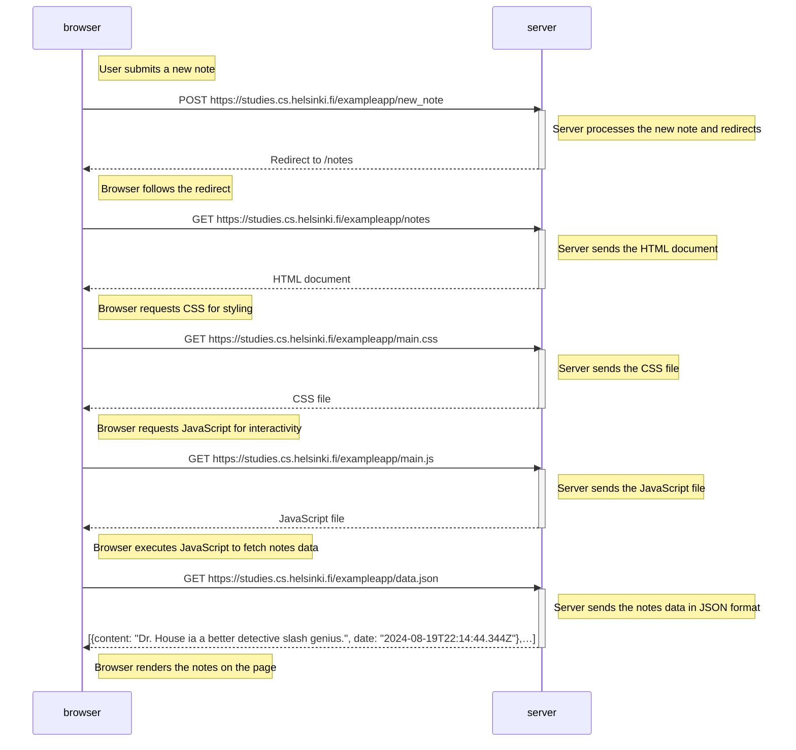

```mermaid
sequenceDiagram
    participant browser
    participant server
    
    Note right of browser: User submits a new note
    browser->>server: POST https://studies.cs.helsinki.fi/exampleapp/new_note
    activate server
    Note right of server: Server processes the new note and redirects
    server-->>browser: Redirect to /notes
    deactivate server

    Note right of browser: Browser follows the redirect
    browser->>server: GET https://studies.cs.helsinki.fi/exampleapp/notes
    activate server
    Note right of server: Server sends the HTML document
    server-->>browser: HTML document
    deactivate server
    
    Note right of browser: Browser requests CSS for styling
    browser->>server: GET https://studies.cs.helsinki.fi/exampleapp/main.css
    activate server
    Note right of server: Server sends the CSS file
    server-->>browser: CSS file
    deactivate server
    
    Note right of browser: Browser requests JavaScript for interactivity
    browser->>server: GET https://studies.cs.helsinki.fi/exampleapp/main.js
    activate server
    Note right of server: Server sends the JavaScript file
    server-->>browser: JavaScript file
    deactivate server
    
    Note right of browser: Browser executes JavaScript to fetch notes data
    browser->>server: GET https://studies.cs.helsinki.fi/exampleapp/data.json
    activate server
    Note right of server: Server sends the notes data in JSON format
    server-->>browser: [{content: "Dr. House ia a better detective slash genius.", date: "2024-08-19T22:14:44.344Z"},…]
    deactivate server

    Note right of browser: Browser renders the notes on the page

```

    
