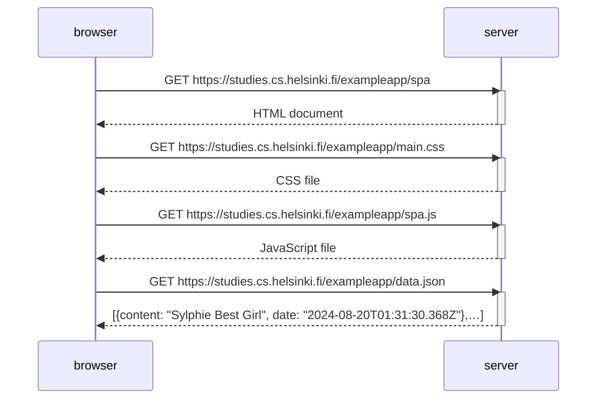

```mermaid
  sequenceDiagram
      participant browser
      participant server
      
      browser->>server: GET https://studies.cs.helsinki.fi/exampleapp/spa
      activate server
      server-->>browser: HTML document
      deactivate server
      
      browser->>server: GET https://studies.cs.helsinki.fi/exampleapp/main.css
      activate server
      server-->>browser: CSS file
      deactivate server
      
      browser->>server: GET https://studies.cs.helsinki.fi/exampleapp/spa.js
      activate server
      server-->>browser: JavaScript file
      deactivate server
      
      browser->>server: GET https://studies.cs.helsinki.fi/exampleapp/data.json
      activate server
      server-->>browser: [{content: "Sylphie Best Girl", date: "2024-08-20T01:31:30.368Z"},…]
      deactivate server

```
