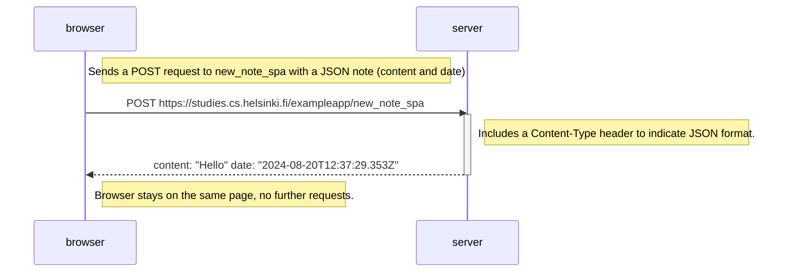

```mermaid
  sequenceDiagram
      participant browser
      participant server

      Note right of browser: Sends a POST request to new_note_spa with a JSON note (content and date)

      browser->>server: POST https://studies.cs.helsinki.fi/exampleapp/new_note_spa
      activate server

      Note right of server: Includes a Content-Type header to indicate JSON format.

      server-->>browser: content: "Hello" date: "2024-08-20T12:37:29.353Z"
      deactivate server

      Note right of browser: Browser stays on the same page, no further requests.
```
